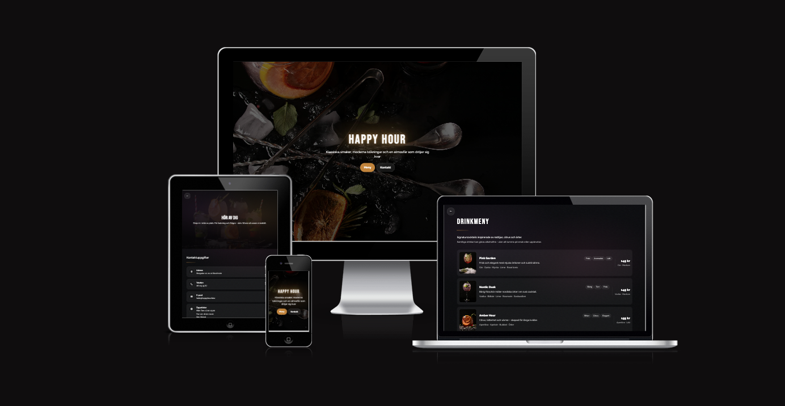

# Happy Hour 🍸

A fictional cocktail bar website built as a sample/portfolio project. Clean, modern, and responsive — showcasing a hero landing page, a drinks menu, and a contact page with booking form.



## Pages

- **Hem** ([index.html](index.html)) — Hero section with the bar's tagline and quick links to the menu and contact page.
- **Meny** ([menu.html](menu.html)) — Showcase of signature cocktails and drinks.
- **Kontakt** ([contact.html](contact.html)) — Contact details, opening hours, and a form for booking a table or sending a message.

## Built with

- HTML5
- [Bootstrap 5](https://getbootstrap.com/)
- Custom CSS ([assets/css/styles.css](assets/css/styles.css))
- [Font Awesome](https://fontawesome.com/) for icons
- [Google Fonts](https://fonts.google.com/) (Bebas Neue & Raleway)

## Getting started

This is a static site — no build step required. Clone the repo and open [index.html](index.html) in your browser, or serve the folder with your favorite local server:

```bash
npx serve .
```

## Note

This is a fictional project created for practice and portfolio purposes. All names, locations, and contact details are made up.
